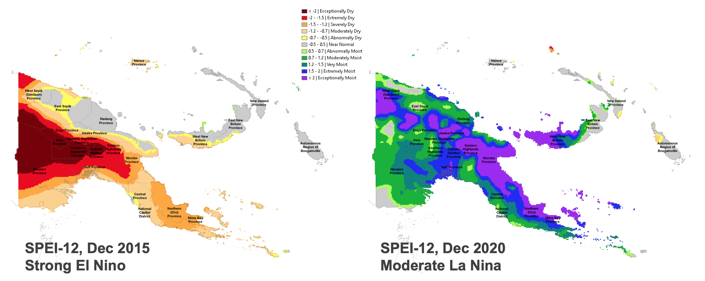
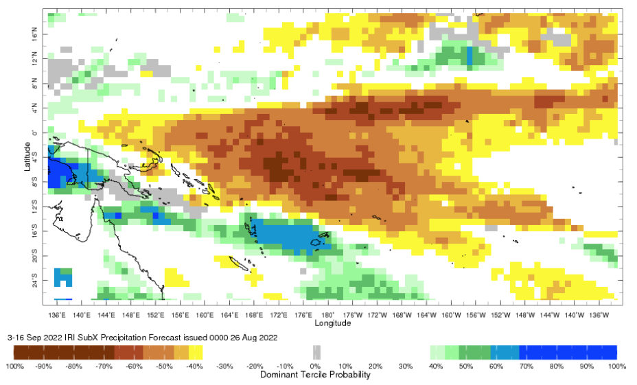
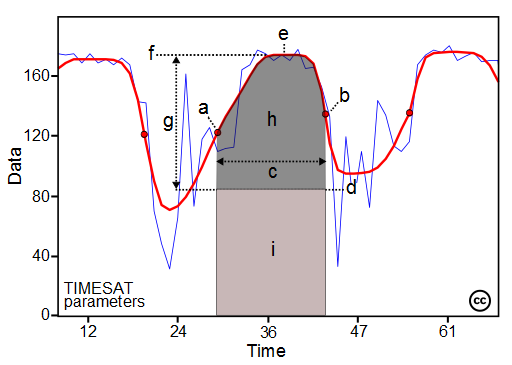
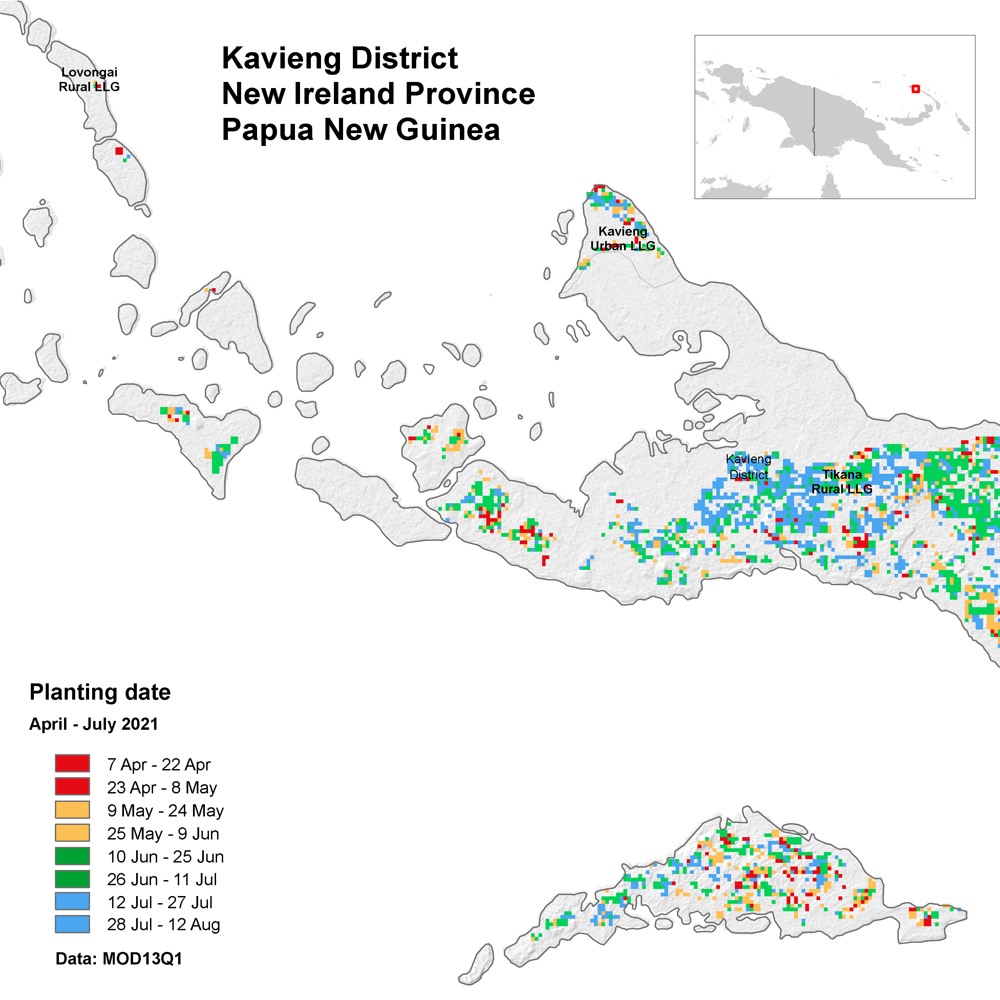

# Climate and Agriculture Monitoring in the Pacific Island Countries

Project: [PACIFIC OBSERVATORY (P177189)](https://operationsportal.worldbank.org/secure/P177189/home). 

Weather conditions and climate variations have profound impacts on agriculture, water resources and on the socioeconomic opportunities and adaptations of a region. The purpose of this activity is to thoroughly monitor the climate of the Pacific Island Countries (PIC) to show how it affects both irrigated and dryland agriculture. 

Through collaborative efforts, we will be better able to prepare for and address the challenges of a changing environment. By knowing past and current climate conditions, local and regional climate variability and how current conditions compare to the past, we help assess current and future water supplies, agricultural production, and other natural resources. 

Weather and climate effects not only agriculture but recreation, transportation, energy supply and demand and many aspects of resource management. Climate information is important for short and long range planning, operational decision making, development of adaptive infrastructure and the management of climate-sensitive risks. Through diverse means of climate monitoring and many channels of information delivery, this activity will help the citizens of PIC see and understand how climate affects their lives and livelihoods.

These following example mostly use low to medium spatial resolution Earth Observation (EO) data for monitoring hydro-meteorological condition and growing seasons (food access, availability and utilizations).

- Food access: there are market accessibility that usually affected by extreme events which will hindering the transportation.

- Food availability: we can get information on cultivation and harvested areas, utilization for domestic consumption or else. 

``````{admonition} Disclaimer
:class: dropdown
Country borders or names do not necessarily reflect the World Bank Group's official position. This map is for illustrative purposes and does not imply the expression of any opinion on the part of the World Bank, concerning the legal status of any country or territory or concerning the delimitation of frontiers or boundaries.
``````

## Climate Variability

Climate variability directly influences many aspects of food and nutrition security, particularly food availability and access. Variation in rainfall is a common element of many natural disasters – droughts, floods, typhoons and tsunamis – and is influenced by global, regional and/or local factors. 

Global climate factors including El Niño-Southern Oscillation (ENSO); regional factors include the Madden-Julian Oscillation, West Pacific Gradient (WPG) and fluctuations in the sea surface temperature (SST) of the Pacific Ocean; and local factors can include elevation, island position, the circulation of land and sea breezes, and land cover.

The level of climate risk is measured based on the strength of ENSO signal on rainfall variability using correlation analysis. This approach is applied because production loss of food crops in Southeast Asia and the Pacific is closely associated with the ENSO phenomena. El Nino years is normally associated with drought years, while La-Nina is often related to wet years which can cause flood hazards. The correlation analysis is applied to monthly rainfall anomaly and sea surface temperature anomaly in NINO region.

The NINO region is optimal for monitoring ENSO and its impacts, while the WPG is measured as the difference in SST between the NINO4 region and the West Pacific region. When the WP is warm during La Nina events, the changes accross the globe can be extreme.

Simple regression applied to indicate the correlation between rainfall anomaly in each area to anomaly of SST in the Pacific Ocean which represent ENSO signals.

`Y = aX + b`, where: `Y` = Rainfall anomaly, `b` = `Y` intercept, `a` = Slope and `X` = SST anomaly


Figure 1. General sensitivity of rainfall to SST changes in NINO3.4 region

Slope map shows the changes in monthly rainfall likely to result from a 1°C change in SST. The map demonstrates the change in rainfall associated with a one degree rise in SST in NINO-3.4 region. Dark blue areas represent more than 50mm increase in monthly rainfall.

ENSO signals used to be the key indicators for agriculture production in some areas. However negative impacts of the signals to production have been reduced with a wide range of adaptations like improvement of irrigation facilities, innovations of drought/flood tolerant variety, etc.

However, the signals remain helpful for hydro-meteorological disasters forecast.


## Climate Monitoring

This involves data of near real-time monitoring of satellite derived precipitation, temperature, evapotranspiration and vegetation indexes. The analysis allows early detection of water stress conditions of vegetation and monitoring of derived phenological parameters.

Now let’s talk about how we can utilize EO data to do climate monitoring for different time period.  
1. Monthly seasonal, for planning and scenario development
2. Daily and forecast, for early warning, disaster preparedness and response, and seasonal planning

### Monthly and Seasonal

Standardized Precipitation-Evapotranspiration Index (SPEI) as one of proxy to measure dry and wet condition that related to soil moisture (agriculture). 


Figure 2. Wet condition

Country averages, Papua New Guinea is wet in the last 20 years, but ENSO signal striking a dry period during 2015-2016.


Figure 3. Dry condition

This chart still related with previous one (ENSO signal, but this is more useful for seasonal or longer time frame. Like slow onset disasters monitoring. We can learn how the dry or wet situation are evolving month-by-month, year-by-year.

Still related with seasonal or longer time frame. below map is comparing situation in 2 different periods, Dec 2015 for Strong El Nino and Dec 2020 for Moderate La Nina.



Figure 4. SPEI 12-months

Long-term historical information is a key for us to understand what happened in the past and see climate variabilities in the areas.
60-years SPEI data is available to better understand and captures the main impact of increased temperatures on water demand.


### Daily

Next is daily extreme rainfall based on satellite precipitation estimates, as an example on how we utilized daily weather data to produce early warning and for disaster response.


Figure 5. Extreme rainfall

There are at least five application of this information
1. Availability monitoring and forecast data on daily extreme rainfall is important to support early warning and anticipatory actions.
2. Will it trigger a landslide too?
3. Which transportation network will be affected?
4. How many population and cropland will be affected by extreme rainfall in the next 3 days?
5. Which area is in early planting and will be damaged?

Other dailiy indices will be meteorological drought based on maximum of consecutive dry days, in its simplest form be described by a lack of precipitation.


Figure 6. Maximum consecutive dry days in 2021

### Forecast

1.	Short-term/Sub-seasonal Forecast: Optimum planting/harvest potential

	Historical records of planting in combination with temperature and rainfall forecasts are helpful to draw a recommendation on optimum planting/harvest potential. Once we have the weather forecast during the 2nd/3rd planting season, we can analyse the type of crops (main or other secondary crops) to grow optimally.

	

	Figure 7. Sub-seasonal Forecast Precipitation

	

	Figure 8. Sub-seasonal Forecast Temperature

2.	Seasonal Forecast: Opportunities during climate extreme events

	Seasonal forecast provides prediction of weather (rainfall) throughout the season. In combination with sub-seasonal forecasts, such information is necessary for improving the Planting Index and optimising harvested areas. As an example, if a certain planted area is damaged by flood/drought, we are able to better plan replantation programs by taking into account the information from long-term forecasts. If the rainfall in the longer term allows, replantation programs can be initiated.

	

	Figure 9. Seasonal Forecast Precipitation

	

	Figure 10. Seasonal Forecast Temperature


### Cyclone Season

Traditionally, areas of tropical cyclone formation are divided into seven basins. These include the north Atlantic Ocean, the eastern and western parts of the northern Pacific Ocean, the southwestern Pacific, the southwestern and southeastern Indian Oceans, and the northern Indian Ocean (Arabian Sea and the Bay of Bengal). 


Figure 11. Tropical cyclone centers and regions. 
Source: https://en.wikipedia.org/wiki/File:Tropical_Cyclone_Centers_and_Regions.png 

1. Western Pacific Ocean

	The West Pacific Ocean is the most active basin on the planet, accounting for one-third of all tropical cyclone activity. Annually, an average of 25.7 tropical cyclones in the basin acquire tropical storm strength or greater; also, an average of 16 typhoons occurred each year during the 1968–1989 period. The basin sees activity year-round; however, tropical activity is at its minimum in February and March.

	

	Figure 12. Tracks of all tropical cyclones in the northwestern Pacific Ocean between 1980 and 2005. The vertical line to the right is the International Date Line.
	Source: https://en.wikipedia.org/wiki/Tropical_cyclone_basins

2. South Pacific Ocean

	Tropical Cyclones that develop within this basin generally affect countries to the west of the dateline, though during years of the warm phase of El Niño–Southern Oscillation cyclones have been known to develop to the east of the dateline near French Polynesia. On average the basin sees nine tropical cyclones annually with about half of them becoming severe tropical cyclones.

	

	Figure 13. Tracks of all tropical cyclones in the southwestern Pacific Ocean between 1980 and 2005
	Source: https://en.wikipedia.org/wiki/Tropical_cyclone_basins

The below picture indicates that during December to May cyclone events occur mostly in South Pacific Ocean, and from June to December most cyclone events happen in West Pacific Ocean.


Figure 14. Tropical cyclone happen in 2019. 
Source: https://upload.wikimedia.org/wikipedia/en/timeline/4dea2f730b024e57a1db72e8dc62f515.png 

## Agriculture Monitoring

Climate and vegetation data sourced from remote sensing satellites (earth observation – EO) are widely used for agricultural monitoring, especially on the growing season. Most of the usage is focused on medium-low resolution data because it is associated with long-term data availability.

These data provide useful information for:

- Providing early warning when climate shocks occur against food security.

- Contextual analysis (food security analysis:food access, availability and utilizations) needed for planning interventions, for example: market operations when crop scarcity occurs. 

	- Food access: market accessibility, extreme events (disaster, war)  hindering the transportation

	- Food availability: cultivation and harvested areas, utilization for domestic consumption or else.

- Availability of cropland area for spring crop planting possibly damaged during conflict will help the team to assess the social, poverty, and economic impacts of climate change.


### Ideal remote sensing data characteristics for vegetation monitoring

Operational data production – routinely produce the same data products at a set time interval.

- Example: production a vegetation condition map each month.

Anomaly, Percent of Normal, Change, or Ranking Maps

- Provide historical context of how current conditions compare to the historical conditions for a specific location and time during the year.

- Easier to differentiate moderate, severe, and extreme drought events.

Data easily accessible and in multiple formats

- Digital data in analysis using GIS and computers

- Graphical maps that can be downloaded and printed for visual analysis

### Vegetation Index

The Enhanced Vegetation Index (EVI) is an 'optimized' index designed to enhance the vegetation signal with improved sensitivity in high biomass regions and improved vegetation monitoring through a de-coupling of the canopy background signal and a reduction in atmosphere influences. 

Whereas the Normalized Difference Vegetation Index (NDVI) is chlorophyll sensitive, the EVI is more responsive to canopy structural variations, including leaf area index (LAI), canopy type, plant physiognomy, and canopy architecture.


Figure 15. MODIS EVI, 2021


Figure 16. MODIS NDVI, 2021


### Methodology

This is how remote sensing data could be used to monitor the crop growing season. Working example based on areas where the majority of cropland is paddy This approach required a crop type mask and moderate resolution time series Vegetation Indices (VI) is needed to do the monitoring. High resolution and frequent data might be useful to monitor crop who doesn't have clear growing season pattern.

For this example, we use MODIS MOD13Q1 data, available at 250m spatial resolution and 16-days of temporal resolution.


Figure 17. Growing season

State of planting and harvesting estimates were determined by importing Vegetation Indices (VI) data into TIMESAT (http://web.nateko.lu.se/timesat/timesat.asp) – a program for analyzing time-series satellite sensor data. TIMESAT conducts pixel-by-pixel classification of satellite images to determine whether planting has started or not. This process was followed for all of areas over multiple years in order to evaluate current planting vis-à-vis historical years from 2003 - 2021 (case using MODIS VI).



Figure 18. TIMESAT Parameters

Some of the seasonality parameters generated in TIMESAT: (a) beginning of season, (b) end of season, (c) length of season, (d) base value, (e) time of middle of season, (f) maximum value, (g) amplitude, (h) small integrated value, (h+i) large integrated value.

The blue line is the real EVI value and red is EVI value after smoothing. The following figure shows the differences in EVI that have not and have been smoothing. 

Phenological events are sensitive to climate variation. Therefore, phenology data provide important baseline information for assessment of ecological trends and detection of climate change impacts on multiple scales.

These phenological parameters are related to the seasonal vegetation productivity, by also considering both agricultural production and available biomass. Comparing their current values with the long-term average, minimum and maximum VI time-series, helps to better understand the performances of the considered vegetative season and its expected productivity.

### Growing Season

Information on the onset of planting seasons (and harvest time) are relevant for decision makers like to see.



Figure 19. Beginning of Season.

The map informs us on the crop planting status.

1. How's the crop planting progress?
2. How many districts are behind in planting?
	- This is also will trigger another question, if there is a delay in some district, should government do planting acceleration?
3. How many hectares crop area that available for next planting?
4. Are the current harvest enough for domestic consumption?

Decision makers also need this kind of seasonal monitoring and data triangulation for better result and information to decide

1. Planting potential for the next 3-months, this is related to distribution of agriculture inputs;
2. Mobilization of extension workers for monitoring and preparing relevant strategy e.g drought/flood anticipation-adjust irrigation system, pest/disease infestation-pest control to avoid crop failure, reservoir readiness for planting season;
3. Prepare relevant policy recommendation: assess on going situation, harvest estimate, price protection, etc

This information is necessary for both policy makers and those who is directly involved in crop production (farmers, rural business, etc). Negative consequences can be anticipated months ahead and distribution of resources is focused on potential areas of planting.

Other potential analysis is also related with the mitigation and adaptation of agriculture sector to climate change, like emission from agriculture land etc.

### Limitations and Assumptions

- Getting VI data with good quality for all period are challenging (pixels covered with cloud, snow/ice, aerosol quantity, shadow) for optic data (MODIS). Radar VI is a good alternative for this.

- Cultivated area year by year are varies, due to MODIS data quality.

- Crop type is not described, so the seasonal parameters are for general cropland.

- This value may not represent for smaller cropland. 

- Presented result are only based on publicly available data on the internet.


## Future Projections

This section is about the future climate projection and it's impact on agriculture, with the case on Change of crop yield due to changing precipitation, temperature, and frequency of hot/cold days in Papua New Guinea.

The WBG Climate Change Knowledge Portal [CCKP](https://climateknowledgeportal.worldbank.org/country/papua-new-guinea) provide projections of Annual number of days with Heat Index >35°C, Anomaly of Precipitation, and Anomaly of Maximum Temperature.

This can be a basis for the projection of crop yield changes. [Elisabeth Vogel et al. (2019)](https://iopscience.iop.org/article/10.1088/1748-9326/ab154b) identified sensitivity of maize, soybeans, spring wheat, and rice to warm day frequency and cold night frequency. [Easterling, W. E. et al. (2007)](https://pubs.giss.nasa.gov/docs/2007/2007_Easterling_ea01000b.pdf) studied cereals, wheat, and rice sensitivity to 1°C increase of temperature in different latitude. Changes in short-term temperature extremes can also be critical, if they coincide with key stages of development. [Wheeler et al. (2000)](https://www.sciencedirect.com/science/article/abs/pii/S0167880900002243?via%3Dihub) identified only a few days of extreme temperature (greater that 32°C) at the flowering stage of many crops can drastically reduce yield


Figure 19. PNG Projections: Annual number of days with heat index > 35oC, Anomaly of precipitation, and Anomaly of Tmax in 2040 – 2059.[^1]

The maps are based on Shared Socioeconomic Pathways [(SSPs)](https://en.wikipedia.org/wiki/Shared_Socioeconomic_Pathways) Scenario 8.5 (worst scenario) for the period 2040 - 2059.

This data allow us to identify relevant adaptation measure or longterm agriculture development plan.

[^1] Reference period: 1995 – 2014. Source: https://climateknowledgeportal.worldbank.org/country/papua-new-guinea/climate-data-projections