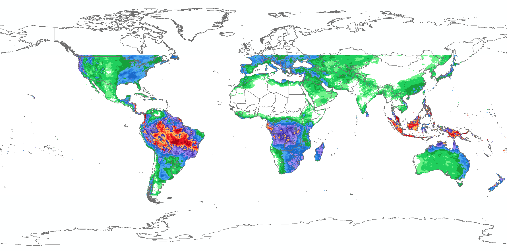

# CHIRPS

Climate Hazards Group InfraRed Precipitation with Station data (CHIRPS) from Climate Hazard Center (CHC), Department of Geography, University of California Santa Barbara - [https://www.chc.ucsb.edu/data/chirps](https://www.chc.ucsb.edu/data/chirps) is a 35+ year quasi-global rainfall data set. Spanning 50°S-50°N (and all longitudes) and ranging from 1981 to near-present, CHIRPS incorporates CHC's in-house climatology, CHPclim, 0.05° resolution satellite imagery, and in-situ station data to create gridded rainfall time series for trend analysis and seasonal drought monitoring.  

To support the activity, GOST utilise CHIRPS's monthly rainfall data.  

**About the data**

| Characteristic  | Description  |
|---|---|
| Function  | Displays daily, pentad, dekad, monthly, 2-monthly, 3-monthly and annual rainfall data  |
| Variable  | Total rainfall  |
| Geographic coverage  | Global 50N-50S, 180W-180E |
| Spatial resolution  | 0.05 degree ~ 5.6 km at equator  |
| Temporal resolution  | daily, pentad, dekad, monthly, 2-monthly, 3-monthly and annual  |
| Format  | GeoTIFF, BIL and NetCDF  |
| Unit  | Total mm for given time step, mm/pentad, mm/month, etc.  |
| Reference  | https://wiki.chc.ucsb.edu/CHIRPS_FAQ  |

**Symbology**

The threshold and the symbology for the `monthly` rainfall in milimeters can follow below colorcodes and image.  

| Class  | Hex  | RGB  |
|---|---|---|
| 0 - 5  | `#ffffff`  | rgb(255, 255, 255)  |
| 5 to 10  | `#69F585`   | rgb(105, 245, 133)  |
| 10 to 25  | `#00D157`   | rgb(0, 209, 87)  |
| 25 to 50  | `#00A133`   | rgb(0, 161, 51)  |
| 50 to 75  | `#4AA6F0`   | rgb(74, 166, 240)  |
| 75 to 100  | `#2485E8`   | rgb(36, 133, 232)  |
| 100 to 150  | `#1266CC`   | rgb(18, 102, 204)  |
| 150 to 200  | `#A38CF7`   | rgb(163, 140, 247)  |
| 200 to 250  | `#7361D6`   | rgb(115, 97, 214)  |
| 250 to 300  | `#402BAD`   | rgb(64, 43, 173)  |
| 300 to 350  | `#FFBF54`   | rgb(255, 191, 84)  |
| 350 to 400  | `#FF5E24`   | rgb(255, 94, 36)  |
| 400 to 500  | `#E60A14`   | rgb(230, 10, 20)  |
| 500 and above  | `#A8000A`   | rgb(168, 0, 10)  |

**Data access**

Official download link from CHIRPS available from: [https://data.chc.ucsb.edu/products/CHIRPS-2.0/](https://data.chc.ucsb.edu/products/CHIRPS-2.0/).  

CHIRPS monthly data also available at DEC S3: `s3://wbgdecinternal-ntl/climate/data/chirps`.  
