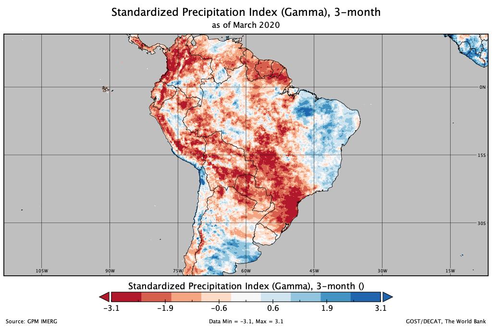
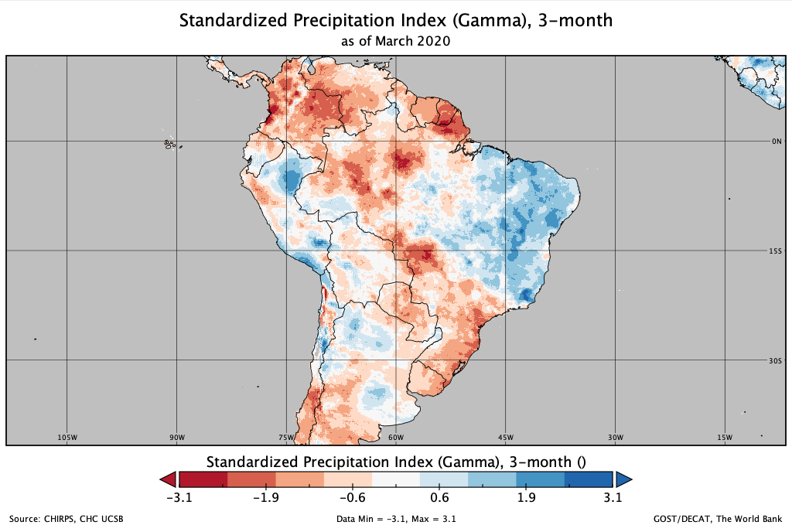
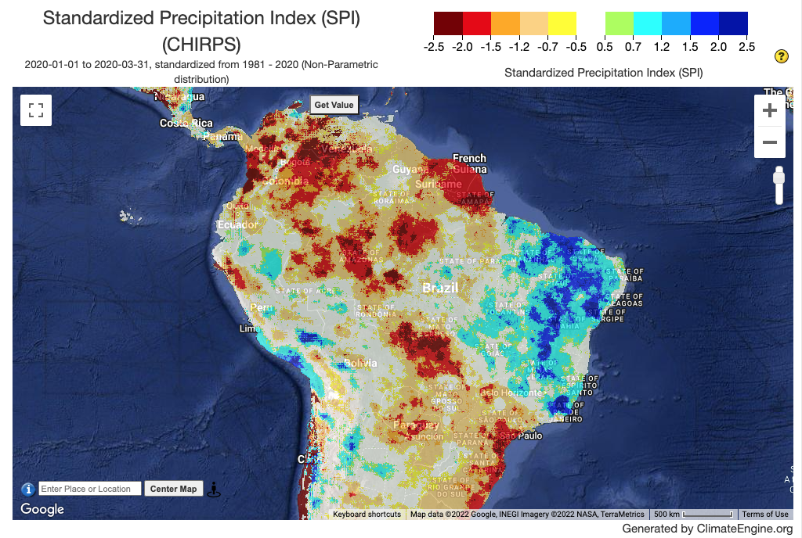
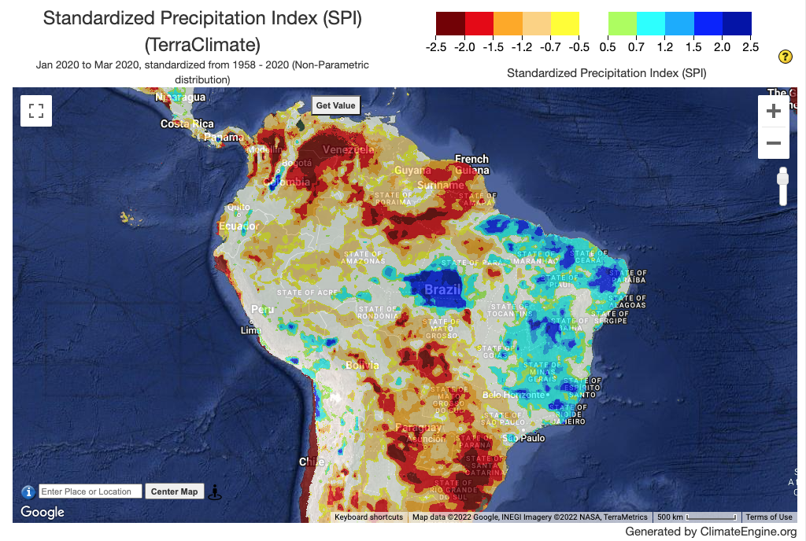
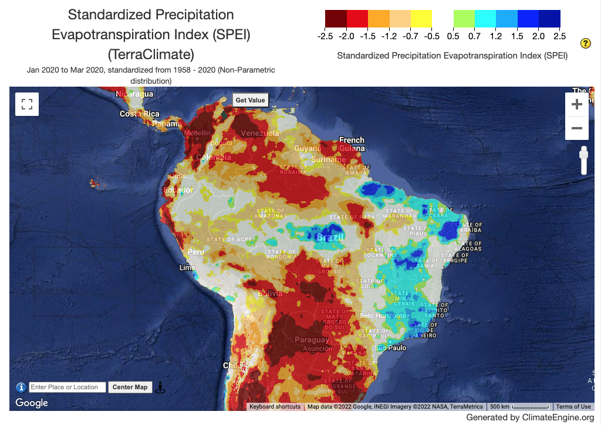

# Example output

Below is the example of SPI calculation using Global IMERG, CHIRPS and TerraClimate data,

**SPI 3-month, March 2020.**

IMERG

CHIRPS

TerraClimate

**SPEI 3-month, March 2020.**

TerraClimate

**And comparison with SPI generated by Climate Engine:**

[**Climate Engine**](http://climateengine.org) is a free web application powered by Google Earth Engine that can be used to create on-demand maps and charts from publicly available satellite and climate data using a standard web browser. Climate Engine allows users to analyze and interact with climate and earth observations for decision support related to drought, water use, agricultural, wildfire, and ecology.

One of the product that could generate easily using Climate Engine are:

* SPI based on CHIRPS [https://climengine.page.link/vgVC](https://climengine.page.link/vgVC)

	

* SPI based on TerraClimate [https://climengine.page.link/kiY2](https://climengine.page.link/kiY2)

	

* SPEI based on TerraClimate [https://climengine.page.link/yQRz](https://climengine.page.link/yQRz)

	