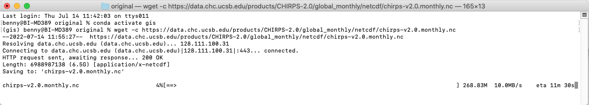
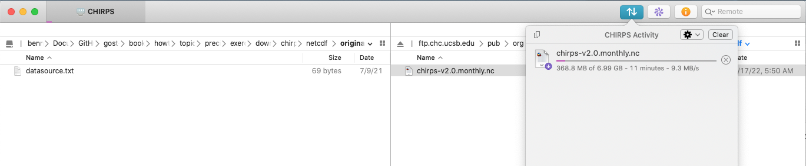
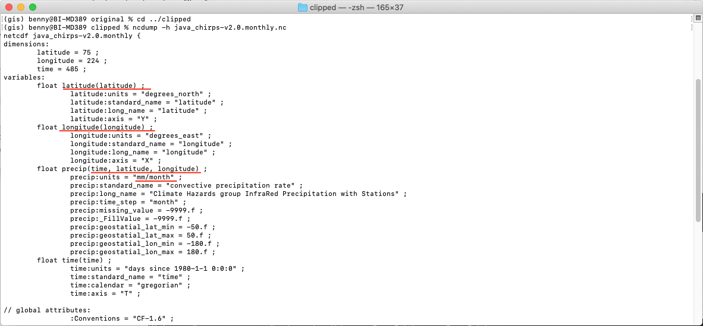
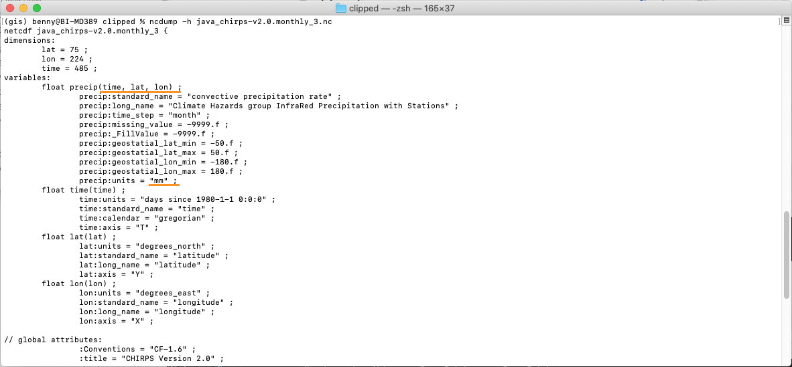

# Monthly CHIRPS in netCDF format

This section will explain on how to download CHIRPS [monthly data in netCDF](https://data.chc.ucsb.edu/products/CHIRPS-2.0/global_monthly/netcdf/) format and prepare it as input for SPI calculation.  

* Make sure you still inside conda `gis` environment.  


## Download CHIRPS data

* Navigate to `downloads/chirps/netcdf/original` folder in the working directory. Download using `wget` all CHIRPS dekad data in netCDF format from Jan 1981 to Apr 2021 (this is lot of data +- 6.4GB, please make sure you have bandwidth and unlimited data package). Paste and Enter below script in your Terminal.  

	```bash
	wget -c https://data.chc.ucsb.edu/products/CHIRPS-2.0/global_monthly/netcdf/pi-chirps-nc-v2.0.monthly.nc
	```

	

* As an alternative, you can download via ftp client like [FileZilla](https://filezilla-project.org). Below is exampe using ftp client [Transmit for Mac](https://www.panic.com/transmit/).  

	


## Extract data based on area of interest

Next step will be extract data using a bounding box based on area of interest.  

```{note}
Below guideline provide example on how to use CDO and NCO to do some data extraction process, you can choose which one is suits you.
```

* Crop your area of interest using bounding box.   
	Example: Java bounding box with format `lon1`,`lon2`,`lat1`,`lat2` is `105.05`,`116.25`,`-8.8`,`-5.05`.  

	Paste and Enter below code in your Terminal.  

	| Software | Script |
	| --- | --- |
	| CDO | `cdo sellonlatbox,105.05,116.25,-8.8,-5.05 chirps-v2.0.monthly.nc ../clipped/java_chirps-v2.0.monthly.nc` |
	| NCO | `ncks -d latitude,-8.8,-5.05 -d longitude,105.05,116.25 chirps-v2.0.monthly.nc -O ../clipped/java_chirps-v2.0.monthly.nc` |

* Let's read header contents of above result. Type and execute below code:

	``` bash
	ncdump -h java_chirps-v2.0.monthly.nc
	```

You will get information (dimension, variables and global attribute) about the data.  




## Edit variable and attribute

As explain in [Input Data and Specification](./input-data-and-specification), we can say from above picture there are few variable and attribute that need editing. Let's do it one-by-one.  

* Navigate to `downloads/chirps/netcdf/clipped` folder in the working directory.  

* Edit variable name for `longitude` to `lon`, and `latitude` to `lat`.  

	Paste and Enter below code in your Terminal.  

	| Software | Script |
	| --- | --- |
	| CDO | `cdo chname,longitude,lon java_chirps-v2.0.monthly.nc java_chirps-v2.0.monthly_1.nc ; cdo chname,latitude,lat java_chirps-v2.0.monthly_1.nc java_chirps-v2.0.monthly_2.nc` |
	| NCO | `ncrename -d longitude,lon -d latitude,lat -v longitude,lon -v latitude,lat java_chirps-v2.0.monthly.nc -O java_chirps-v2.0.monthly_2.nc` |

* Edit precipitation unit from `mm/month` to `mm`.  

	Paste and Enter below code in your Terminal.  

	| Software | Script |
	| --- | --- |
	| CDO | `cdo -setattribute,precip@units="mm" java_chirps-v2.0.monthly_2.nc java_chirps-v2.0.monthly_3.nc` |
	| NCO | `ncatted -a units,precip,modify,c,'mm' java_chirps-v2.0.monthly_2.nc java_chirps-v2.0.monthly_3.nc` |

* Let's read header contents of above result. Type and execute below code:

	``` bash
	ncdump -h java_chirps-v2.0.monthly_3.nc
	```

And check the variable name and precipitation unit.  



Once this has completed, the dataset can be used as input to this package for computing SPI. From above picture, some of the precipitation attribute are still wrong: `DimensionNames` and `Units`. We can leave it as is, SPI code will only read `units` and variables `precip(time,lat,lon)`.  

As the input data preparation is completed, move the file `java_chirps-v2.0.monthly_3.nc` to main folder `input_nc` and rename into `java_cli_imerg_1months_1981_2020.nc`.  

``` bash
mv java_chirps-v2.0.monthly_3.nc ../../../../input_nc/java_cli_imerg_1months_2000_2020.nc
```

Make sure the file `java_cli_imerg_1months_1981_2020.nc` is available at `input_nc` folder.  